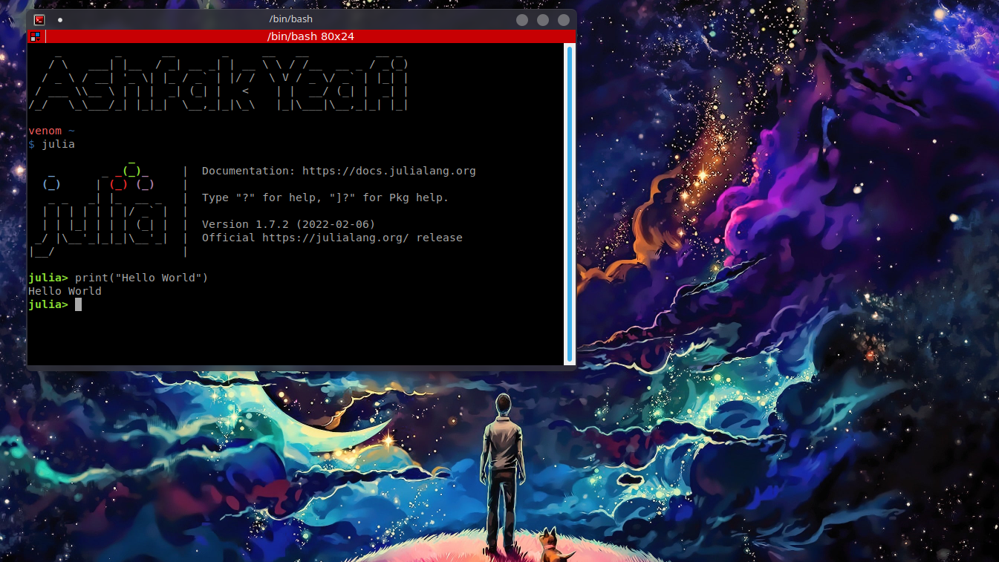

# Julia

Julia is a high-level, high-performance, dynamic programming language. While it is a general-purpose language and can be used to write any application, many of its features are well suited for numerical analysis and computational science
## Installation

Use the Linux terminal to install Julia.

```bash
cd ~/Downloads
```

```bash
wget https://julialang-s3.julialang.org/bin/linux/x64/1.7/julia-1.7.2-linux-x86_64.tar.gz
```

```bash
tar -xvzf julia-1.7.2-linux-x86_64.tar.gz
```

```bash
sudo cp -r julia-1.7.2 /opt/
```
```bash
sudo ln -s /opt/julia-1.7.2/bin/julia /usr/local/bin/julia
```


## Usage
```bash
julia
```

```julia
print("Hello World")

```

<p align="center">
  
</p>


## License
[MIT](https://choosealicense.com/licenses/mit/)
